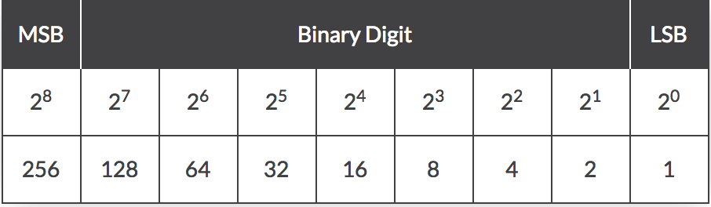
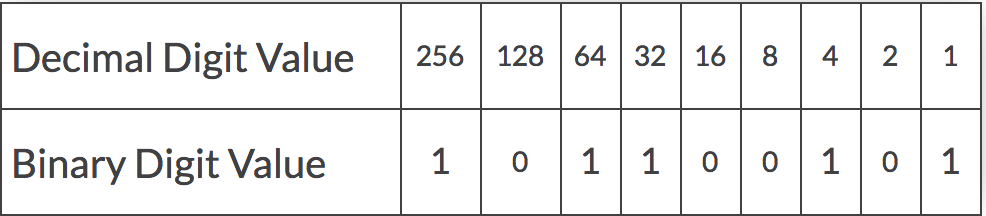

# Converting from Binary

---
* To convert from binary into decimal we must understand what each 1 or 0 means

* This image shows what 8 bits (a byte) represents. It helps to think of the 1's and 0's as switches and 1's means the switch is turned on. So if In other words if our binary number 1010, we would have our switch turned on at the 8 and 2 position, making the decimal number come out to 10.

* If our binary number was '101100101'(as shown below) we would add up all the numbers that have the switch turned on, meaning the 1's. 256+64+32+4+1=357

---
[Back](README.md)
