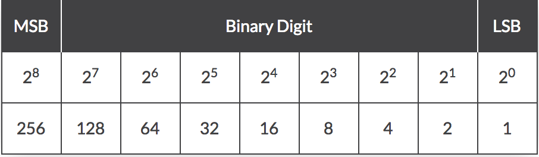
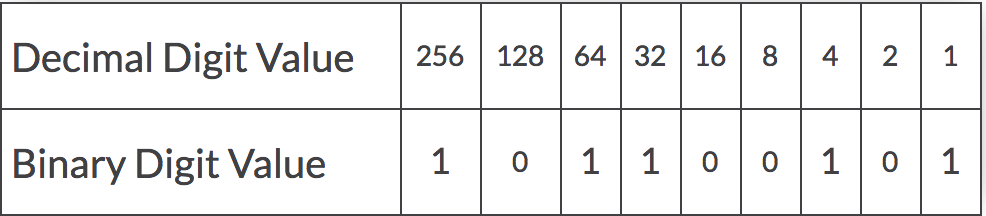

# Converting into Binary

[In Depth Look at Conversions](https://www.wikihow.com/Count-in-Binary)

---

* To convert from decimal notation into binary we must first understand what each 1 or 0 means

* As shown in this image, the number that a specific '1' would represent doubles as the number gets higher. If we were trying to print out a decimal number of '6' the binary notation would be '110'. This is because binary works its way down the number line starting with the largest number that goes into the desired conversion. For the '6' example we start at the left of the number line and drop down until a number fits inside '6', that number being '4'. When the number fits, we put a 1 and continue down the line until the conversion is complete.
* Here is an example of how to convert the decimal number '357' into binary.

* Just as in our previous example, they work their way down the number line, filling in ones where the number fits. Does 256 go into 357? Yes, put a one and find the remainder. 128 into 101? No, put a zero. 64 into 101? Yes, put a one and find the remainder. Etc.

---
[Back](README.md)
